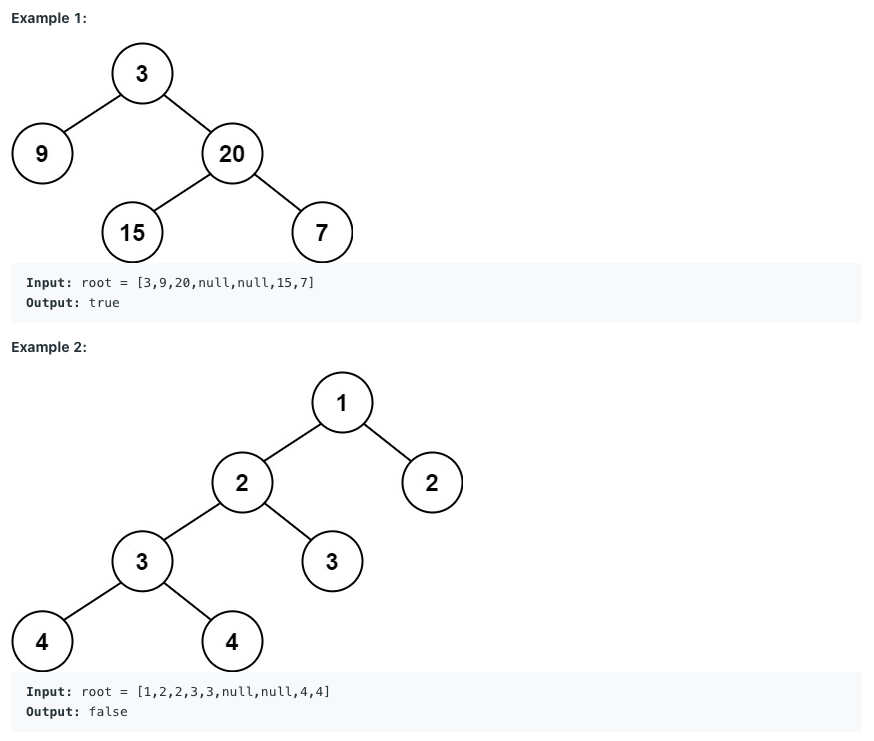

# 110. Balanced Binary Tree

Given a binary tree, determine if it is height-balanced.

For this problem, a height-balanced binary tree is defined as:

> a binary tree in which the left and right subtrees of every node differ in height by no more than 1.



### Solution

- 之前的解法是对于每一个node的左右子结点求自顶向下遍历求高度，其实是没有必要的，完全可以自底向上返回的过程判断是否有结点违背balanced binary tree的定义
- 使用dfs，遍历到底才开始递归向root返回高度，递归过程如果遇到左右subtree高度差大于1则最终结果为false

```java
class Solution {
    //time complexity O(n * log(n)) || space complexity O(1)
    public boolean isBalanced(TreeNode root) {
        if(root == null)
            return true;
        int leftHeight = height(root.left);
        int rightHeight = height(root.right);
        if(Math.abs(leftHeight - rightHeight) > 1)
            return false;
                
        return isBalanced(root.left) && isBalanced(root.right);
    }
    
    private int height(TreeNode root){
        if(root == null)
            return 0;
        
        return Math.max(height(root.left), height(root.right)) + 1;
    }
}
```

```java
class Solution {
    boolean isBalanced = true;
    public boolean isBalanced(TreeNode root) {
        if(root == null) return true;
        dfs(root);
        return isBalanced;
    }

    private int dfs(TreeNode root) {
        if(root == null) return 0;
        int leftHeight = dfs(root.left);
        int rightHeight = dfs(root.right);
        if(Math.abs(leftHeight - rightHeight) > 1) isBalanced = false;

        return Math.max(leftHeight, rightHeight) + 1;
    }
}
```
