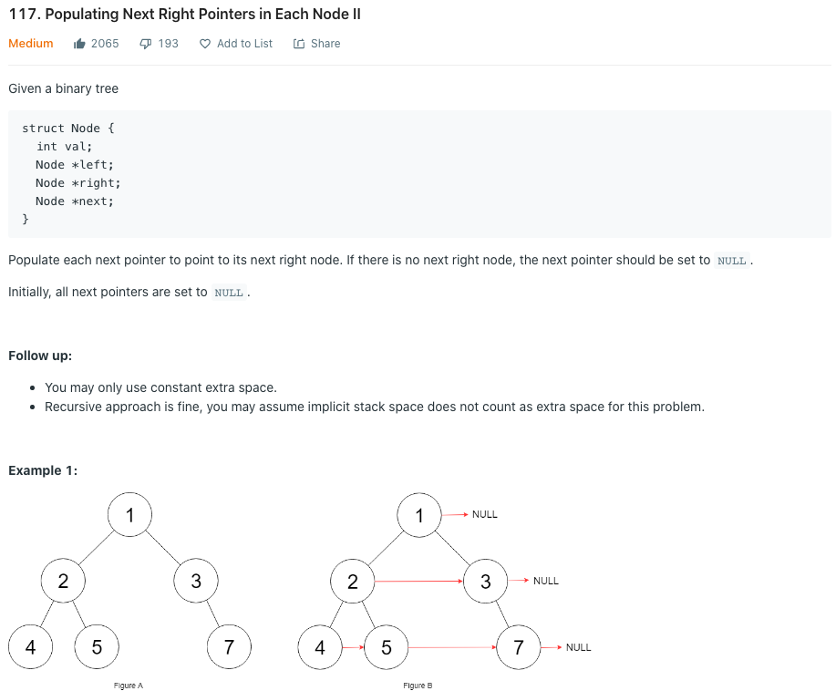

# 117. Populating Next Right Pointers in Each Node II

- 将树中的每一个node与它的同一level的右侧结点相连接



### Solution 1

- 首先想到的是BFS，用一个queue按照level order traverse 的方法将node加入队列，然后再按层提取出来
- 使用Pair<Node, Integer> pair构建非常之麻烦，我采取的方式是在当前层node入队列的同时记录下一层新加入队列的子结点的个数，作为遍历下一层的依据
- 这样的话time complexity O(N) | space complexity O(N + 1 / 2) ~ O(N) (最坏的情况是the given tree是满二叉树，这样the worst case是将最后一层的全部结点加入到queue中)

```java
/*
// Definition for a Node.
class Node {
    public int val;
    public Node left;
    public Node right;
    public Node next;

    public Node() {}
    
    public Node(int _val) {
        val = _val;
    }

    public Node(int _val, Node _left, Node _right, Node _next) {
        val = _val;
        left = _left;
        right = _right;
        next = _next;
    }
};
*/

class Solution {
    public Node connect(Node root) {
        if(root == null)
            return null;
        int count = 1;
        LinkedList<Node> queue = new LinkedList<>();
        queue.addLast(root);
        Node cur, nex;
        while(!queue.isEmpty()){
            cur = queue.removeFirst();
            count--;
            int count2 = 0;
            while(count >= 0){
                nex = count == 0 ? null : queue.removeFirst();
                cur.next = nex;
                if(cur.left != null){
                    queue.addLast(cur.left);
                    count2++;
                }
                if(cur.right != null){
                    queue.addLast(cur.right);
                    count2++;
                }
                cur = nex;
                count--;
            }
            count = count2;      
        }
        
        return root;
    }
}
```

### Solution 2

- 看了leetcode上大神的解法，其实可以不用借助额外的space，利用next将结点横向链接的特点，我们其实不需要借助queue就能横向遍历当前的level,在遍历当前level的同时可以将当前level的child nodes一次链接起来，非常巧妙

```java
class Solution {
    public Node connect(Node root) {
        if(root == null) return null;
        Node cur = root;
        Node dummy = new Node(-1);
        Node p = dummy;
        
        while(cur != null){
            while(cur != null){
                if(cur.left != null){
                    p.next = cur.left;
                    p = p.next;
                }
                if(cur.right != null){
                    p.next = cur.right;
                    p = p.next;
                }
                cur = cur.next;
            }
            cur = dummy.next;
            dummy = new Node(-1);
            p = dummy;
        }
        return root;
    }
}
```
