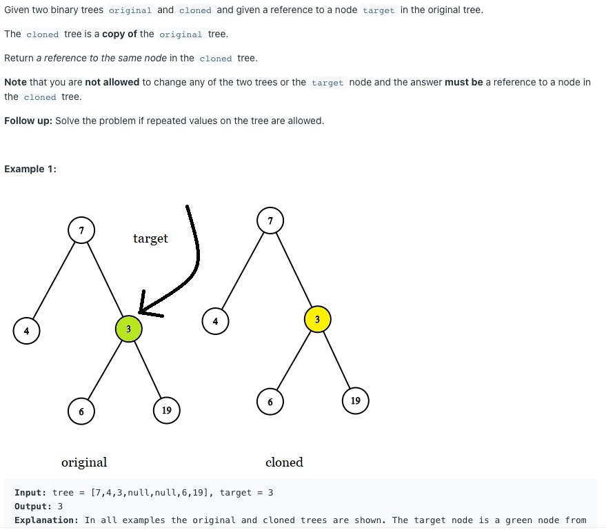

# 1379. Find a Corresponding Node of a Binary Tree in a Clone of That Tree



### Solution

- dfs in the cloned `TreeNode` using the val of target Node does not solve the follow up question: solve the problem if repeated values on the tree are allowed. So we simply do simultaneously dfs on the original and cloned tree. When we find the target Node in the original tree, the position we currently are in the cloned tree is the result we want.

```c
/**
 * Definition for a binary tree node.
 * public class TreeNode {
 *     int val;
 *     TreeNode left;
 *     TreeNode right;
 *     TreeNode(int x) { val = x; }
 * }
 */

class Solution {
    //time complexity O(N) || space complexity O(H) stack space
    public final TreeNode getTargetCopy(final TreeNode original, final TreeNode cloned, final TreeNode target) {
        if(original == target) return cloned;
        TreeNode leftNode, rightNode;
        leftNode = rightNode = null;
        if(original.left != null) leftNode = getTargetCopy(original.left, cloned.left, target);
        if(original.right != null) rightNode = getTargetCopy(original.right, cloned.right, target);
        
        return leftNode == null ? rightNode : leftNode;
    }
}
```
